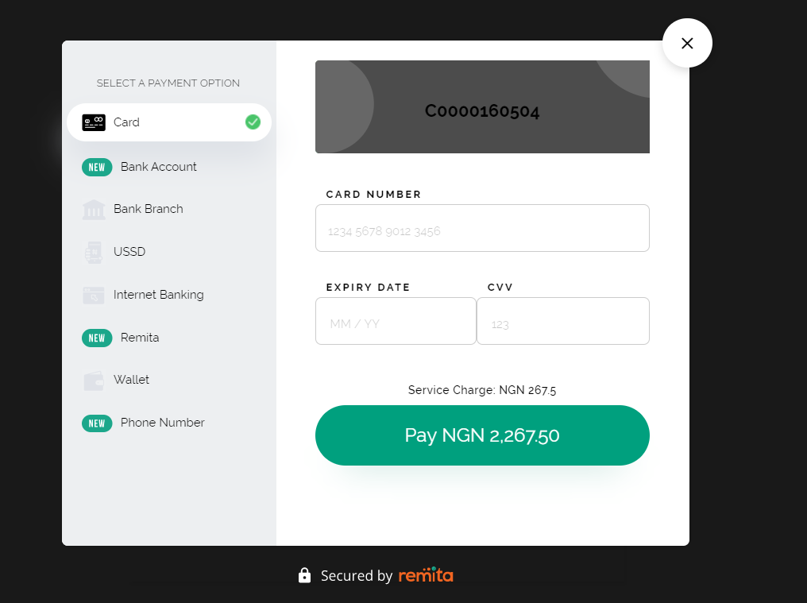

# react-remita

This is a react library for integrating the Remita payment gateway

## Demo

## Get Started

This React library provides a wrapper to add Remita Payment Checkout to your React application

### Install

npm install react-remita --save


or with `yarn`

sh
yarn add react-remita


### Usage

This library can be integrated into any react application by using a button provided by the library

### Using the Remita button

sample javascript
````
import "./App.css";
import RemitaPayment from "react-remita";
import { useState } from "react";

function App() {
  const [paymentData, setpaymentData] = useState({
    key: "", // enter your key here
    customerId: "",
    firstName: "",
    lastName: "",
    email: "",
    amount: null,
    narration: "",
  });
  let data = {
    ...paymentData,
    onSuccess: function (response) {
      // function callback when payment is successful
      console.log("callback Successful Response", response);
    },
    onError: function (response) {
      // function callback when payment fails
      console.log("callback Error Response", response);
    },
    onClose: function () {
      // function callback when payment modal is closed
      console.log("closed");
    },
  };

  return (
    <div className='App'>
      <div className='container'>
        <p>Pay with remita example</p>
        <input
          type='text'
          placeholder='firstname'
          onChange={(e) =>
            setpaymentData({ ...paymentData, firstName: e.target.value })
          }
        />
        <input
          type='text'
          placeholder='lastname'
          onChange={(e) =>
            setpaymentData({ ...paymentData, lastName: e.target.value })
          }
        />
        <input
          type='text'
          placeholder='email'
          onChange={(e) =>
            setpaymentData({ ...paymentData, email: e.target.value })
          }
        />
        <input
          type='text'
          placeholder='amount'
          onChange={(e) =>
            setpaymentData({ ...paymentData, amount: e.target.value })
          }
        />
        <input
          type='text'
          placeholder='description(optional)'
          onChange={(e) =>
            setpaymentData({ ...paymentData, narration: e.target.value })
          }
        />
        <RemitaPayment
          remitaData={data}
          className='btn' // class to style the button
          text='Pay with Remita' //text to show on button
          // add a 'live' prop to use the live urls/keys
        />
      </div>
    </div>
  );
}

export default App;

````

Sample Css Styling
```
body {
  margin: 0;
  font-family: -apple-system, BlinkMacSystemFont, "Segoe UI", "Roboto", "Oxygen",
    "Ubuntu", "Cantarell", "Fira Sans", "Droid Sans", "Helvetica Neue",
    sans-serif;
  -webkit-font-smoothing: antialiased;
  -moz-osx-font-smoothing: grayscale;
}
* {
  box-sizing: border-box;
}
.App {
  width: 100%;
  height: 100vh;
  display: flex;
  justify-content: center;
  align-items: center;
}
.container {
  width: 500px;
  box-shadow: 2px 3px 3px #eee;
  padding: 30px;
}
.container p {
  text-align: center;
  font-size: 16px;
}
input {
  width: 100%;
  height: 50px;
  border: 1px solid #c4c4c4;
  padding: 12px;
  font-size: 16px;
  margin-bottom: 12px;
  border-radius: 4px;
}
.btn {
  width: 100%;
  height: 50px;
  padding: 12px;
  font-size: 16px;
  margin-bottom: 12px;
  border-radius: 4px;
  background-color: rgb(71, 43, 0);
  color: #fff;
  border: 0;
}

```
You can obtain your public key by signing up on [Remita](https://remita.net) as an integrator.

## Deployment

REMEMBER TO CHANGE THE KEY WHEN DEPLOYING ON A LIVE/PRODUCTION SYSTEM AND ALSO INCLUDE THE live PROP WHEN SWITCHING TO PRODUCTION

## Contributing

1. Fork it!
2. Create your feature branch: `git checkout -b feature-name`
3. Commit your changes: `git commit -am 'Some commit message'`
4. Push to the branch: `git push origin feature-name`
5. Submit a pull request

Thanks!.

## License

This project is licensed under the MIT License - see the [LICENSE.md](LICENSE.md) file for details